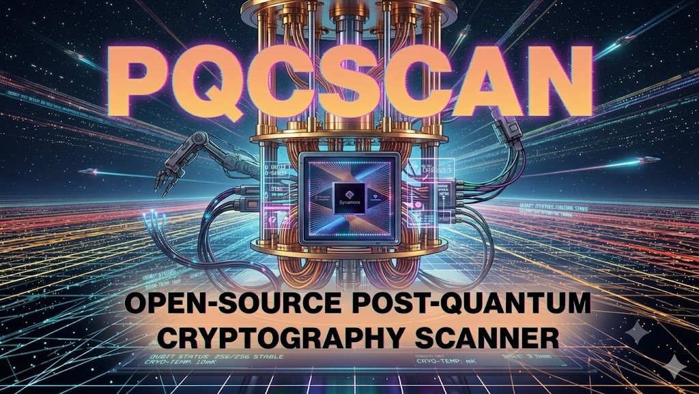

<p align="center">
  
</p>


*Scan SSH/TLS servers for PQC support, validate real handshake behavior, and assess quantum risk*

> **Fork note:** This fork extends [pqcscan](https://github.com/anvilsecure/pqcscan) by Anvil Secure with full TLS handshake validation, downgrade attack detection, quantum risk assessment, SCSV fallback testing, and X.509 certificate analysis. It goes beyond checking what servers advertise to validating what they actually negotiate — and flags whether captured traffic is decryptable by a future quantum computer.

## Table of Contents

- [What pqcscan Does](#what-pqcscan-does)
  - [Level 1: Advertisement Detection](#level-1-advertisement-detection-default)
  - [Level 2: Full Handshake Validation](#level-2-full-handshake-validation---validate-handshake)
  - [Level 3: Risk Assessment](#level-3-risk-assessment)
- [Validated PQC Algorithms](#validated-pqc-algorithms)
- [Installation](#installation)
- [Usage](#usage)
  - [Quick Scan](#quick-scan-advertisement-detection)
  - [Full Handshake Validation with Risk Assessment](#full-handshake-validation-with-risk-assessment)
  - [CSV Export](#csv-export)
  - [HTML Report](#html-report)
  - [Example Output](#example-output)
  - [All Options](#all-options)
- [How It Works](#how-it-works)
- [Screenshots](#screenshots)
- [Contributing](#contributing)

---
---

# What pqcscan Does

**pqcscan** scans SSH and TLS servers for post-quantum cryptography support. It operates at three levels of depth:

### Level 1: Advertisement Detection (default)
Sends raw TLS ClientHello messages to probe which PQC key exchange groups a server accepts. Parses the ServerHello to extract the negotiated cipher suite, key exchange group, TLS version, and detects HelloRetryRequests (RFC 8446). For SSH, reads the server's `SSH_MSG_KEXINIT` to identify PQC KEX algorithms.

### Level 2: Full Handshake Validation (`--validate-handshake`)
Completes three real TLS handshakes per target using [rustls](https://github.com/rustls/rustls):

1. **PQC-only** (TLS 1.3) — offers only PQC key exchange groups; if the server doesn't support PQC, the handshake fails
2. **Classical-only** (TLS 1.3) — excludes all PQC groups to test fallback behavior
3. **TLS 1.2 probe** — tests whether the server accepts the legacy protocol

Each handshake goes through the full lifecycle: key exchange, encrypted extensions, certificate verification, and Finished messages. The tool also tests [TLS_FALLBACK_SCSV](https://www.rfc-editor.org/rfc/rfc7507) (RFC 7507) to check if the server detects version downgrade attempts.

### Level 3: Risk Assessment
Compares handshake results to detect **downgrade attacks** (server chose classical when PQC was offered) and runs a quantum risk assessment. The overall rating uses a 5-tier severity scale:

| Rating | Icon | Meaning |
|---|---|---|
| CRITICAL | 🔴 | No PQC — all traffic is quantum-decryptable |
| HIGH | 🟠 | PQC advertised but not negotiated, or active downgrade risk |
| MODERATE | 🟡 | PQC active, but legacy TLS 1.2 fallback paths remain |
| LOW | 🟢 | PQC active, no TLS 1.2 fallback, minor concerns only |
| INFO | ✅ | Fully quantum-safe (theoretical — requires ML-DSA certificates) |

Individual findings are assessed across key exchange, protocol fallback, and certificates:

| Check | What it detects |
|---|---|
| No PQC key exchange | All traffic is quantum-decryptable (CRITICAL) |
| Static RSA key exchange | TLS 1.2 with no forward secrecy (CRITICAL) |
| TLS 1.2 fallback (no PQC) | Attacker can harvest quantum-vulnerable traffic (HIGH) |
| TLS 1.2 fallback (PQC active) | Legacy path remains but primary sessions are quantum-safe (MODERATE) |
| PQC advertised but not negotiated | Server claims PQC but chose classical (HIGH) |
| Downgrade amplification | Active attacker can force quantum-vulnerable exchange (HIGH) |
| RSA/ECDSA certificates | Classical keys are quantum-forgeable — capped at MODERATE when PQC key exchange is active (requires active MitM, not passive harvest) |

X.509 certificates are parsed to extract key type (RSA, ECDSA-P-256, Ed25519), key size, and validity period. SSH servers get their own risk assessment based on advertised KEX algorithms and classical fallback risk.

---

# Validated PQC Algorithms

The tool covers all NIST FIPS 203 (ML-KEM) key exchange variants deployed in TLS today:

| Algorithm | Type | TLS Group ID |
|---|---|---|
| ML-KEM-512 | Standalone | 0x0200 (512) |
| ML-KEM-768 | Standalone | 0x0201 (513) |
| ML-KEM-1024 | Standalone | 0x0202 (514) |
| X25519MLKEM768 | Hybrid (X25519 + ML-KEM-768) | 0x11EC (4588) |
| SECP256R1MLKEM768 | Hybrid (P-256 + ML-KEM-768) | 0x11EB (4587) |
| SECP384R1MLKEM1024 | Hybrid (P-384 + ML-KEM-1024) | 0x11ED (4589) |

For SSH, the tool identifies PQC KEX algorithms including `sntrup761x25519-sha512` (OpenSSH) and `mlkem768x25519-sha256` (newer implementations).

ML-DSA (FIPS 204) and SLH-DSA (FIPS 205) signature algorithms are not yet covered — no production TLS servers use PQC certificates today.

---
---

# Installation

## Binary Releases
Binary releases for Linux, macOS, and Windows are available on the [releases](https://github.com/anvilsecure/pqcscan/releases) page.

## Building from Source

Requires Rust 1.83 or later (for rustls compatibility).

```
git clone https://github.com/anvilsecure/pqcscan.git
cd pqcscan
cargo build --release
./target/release/pqcscan --help
```

---

# Usage

## Quick Scan (Advertisement Detection)

```bash
# Scan a single TLS target
pqcscan tls-scan -t cloudflare.com

# Scan a single SSH target
pqcscan ssh-scan -t github.com:22

# Scan from a target list with JSON output
pqcscan tls-scan -T targets.txt -o results.json

# Scan with HTML report
pqcscan tls-scan -T targets.txt --validate-handshake --report report.html
```

## Full Handshake Validation with Risk Assessment

```bash
pqcscan tls-scan -t cloudflare.com --validate-handshake
```

This performs three real handshakes, tests SCSV fallback signaling, parses the server certificate, and produces a risk rating.

## CSV Export

```bash
pqcscan tls-scan -T targets.txt --validate-handshake --csv results.csv
```

One row per target with columns: host, port, protocol, pqc_supported, pqc_algorithms, negotiated_group, negotiated_cipher, tls12_fallback, risk_level, scsv_supported, cert_key_type, cert_key_bits, cert_validity_days.

## HTML Report

```bash
pqcscan tls-scan -T targets.txt --validate-handshake --report report.html
```

The `--report` flag works on both `tls-scan` and `ssh-scan` subcommands, generating an HTML report directly from scan results.

## Example Output

```
$ pqcscan tls-scan -t cloudflare.com --validate-handshake

═══════════════════════════════════════════════════════════════
  PQCscan Summary
═══════════════════════════════════════════════════════════════

  Scanned cloudflare.com:443 in 5.05s

  ┌─ cloudflare.com:443 (TLS)
  │
  │  🟡 Risk Assessment: MODERATE
  │  ✅ PQC Key Exchange: X25519MLKEM768 (TLS 1.3)
  │  ✅ TLS Fallback SCSV: Supported
  │  ⚠️  Vulnerable key exchange algorithms:
  │        - ECDHE (TLS 1.2)
  │        - X25519 (TLS 1.3)
  │  ⚠️  Vulnerable certificate algorithms:
  │        - ECDSA-P-256
  │
  │  🔧 Remediation:
  │     Key Exchange:
  │        - Plan TLS 1.2 deprecation per NIST SP 800-52 Rev. 2
  │     Certificates:
  │        - Adopt ML-DSA certificates when available
  └────────────────────────────────────────

═══════════════════════════════════════════════════════════════
```

## Verbose Logging

```bash
RUST_LOG=debug pqcscan tls-scan -t example.com --validate-handshake
```

## All Options

```
pqcscan --help
```

Key flags for `tls-scan`:
- `-t HOST:PORT` — single target (port 443 is default)
- `-T FILE` — target list (one per line, `#` comments supported)
- `-o FILE` — JSON output
- `--csv FILE` — CSV output
- `--report FILE` — HTML report output
- `--validate-handshake` — full handshake validation + risk assessment
- `--only-hybrid-algos` — limit to hybrid PQC algorithms
- `--test-nonpqc-algos` — also test classical groups
- `--num-threads N` — parallel scan threads (default: 8)

Key flags for `ssh-scan`:
- `-t HOST:PORT` — single target (port 22 is default)
- `-T FILE` — target list
- `-o FILE` — JSON output
- `--report FILE` — HTML report output
- `--num-threads N` — parallel scan threads (default: 8)

---

# How It Works

The tool uses two complementary approaches:

**Raw byte scanner** (`src/tls.rs`) — Constructs TLS ClientHello messages from scratch using `byteorder`, sends them over TCP, and parses the ServerHello response byte by byte. This is how the original pqcscan works. It tests each PQC group individually by offering it as the only supported group and checking if the server accepts or rejects it.

**rustls-based validator** (`src/handshake.rs`) — Uses the [rustls](https://github.com/rustls/rustls) TLS library with [rustls-post-quantum](https://crates.io/crates/rustls-post-quantum) to complete real handshakes with actual key exchange. This validates that the server doesn't just accept PQC groups but actually completes the full cryptographic handshake with them.

**Risk assessment engine** (`src/hndl.rs`) — Takes all collected data (PQC support, handshake results, TLS 1.2 fallback, certificate details, downgrade detection) and produces a severity-rated risk assessment.

---

# Screenshots

## Main Scan Results Overview


## SSH Scan Results Sample


## TLS Scan Results Sample


---

# Contributing

The code is idiomatic Rust with zero warnings. Pull requests and issues are welcome. See the `TODO` file for known areas of improvement.

The original pqcscan was created by Vincent Berg at [Anvil Secure](https://anvilsecure.com). This fork adds handshake validation, risk assessment, and related features.
